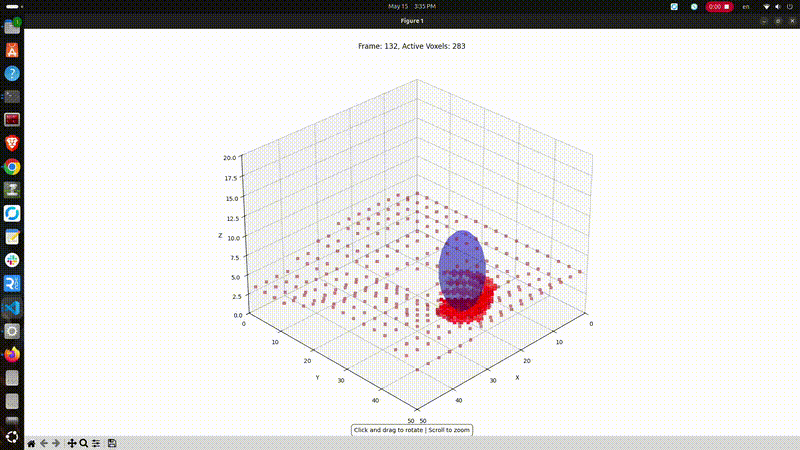
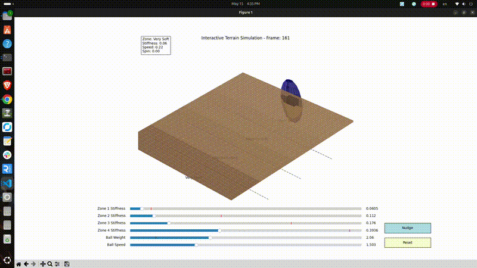

# rose-pcl-deform
<!-- This project is under progress -->

This project simulates a rigid ball dragging across a deformable voxel terrain with varying ground stiffness. It visually demonstrates how terrain deformation and ball motion are affected by the underlying stiffness zones, using 3D animation with `matplotlib`.

Here I am reimagining each particle as a point in a point cloud and voxelizing the cloud to lessen computational burden. Then each voxel is now the tip of a spring that abides by the F= - Kx priciple to simulation stiffness-wise deformation. Only the voxels is surface contact or about to contact are activated and physics and computed for those voxels only.

So we are going from this:


To this:



## Features

- 3D voxel grid terrain with 4 stiffness zones (Very Soft → Very Hard)
- Rigid body (ball) physics including collision, bounce, rolling, and deformation
- Real-time terrain deformation and voxel dislodging
- Visualization with live animation in a `matplotlib` 3D plot

## Requirements

Install the Python dependencies using:

```bash
pip install -r requirements.txt
````

> Make sure you have a GUI backend for `matplotlib` (e.g., `TkAgg` is used by default).

## How to Run

Run the simulation script:

```bash
python app.py
```

This will open an interactive 3D animation window where you can:

* Rotate the view with your mouse
* Scroll to zoom
* Watch the ball interact differently with each ground stiffness zone

## File Overview

* `multi_terrain_test.py`: Main simulation and visualization script
* `point_test.py`: Uses points instead of surface
* `requirements.txt`: List of required Python packages


